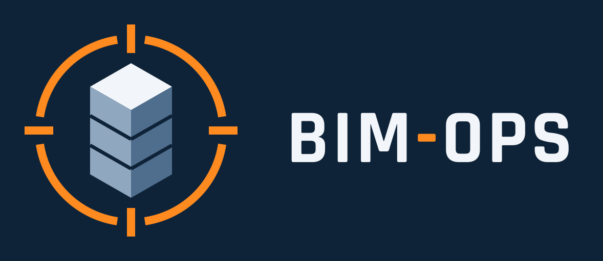

# BIM-Ops

**A first-person team shooter played inside real buildings, straight from Revit.**

Export a building from Autodesk Revit and fight through it with friends over your local network. Its walls,
floors, stairs and roofs come through, and so do doors that open, windows that shatter, and the architect's own
rooms. Built with Unreal Engine 5.

This repository holds the **downloads** only. Get them from [Releases](../../releases/latest).

---

## Download

| File | What it is |
|---|---|
| `BIM-Ops-<version>-Setup.exe` | **The game.** Installs it with the Visual C++ runtime and a LAN firewall rule (needs admin). |
| `BIM-Ops-<version>.zip` | The game without an installer: unzip it and run `BimOps.exe`. |
| `BIM-Ops-Revit-AddIn-<version>-Setup.exe` | **The Revit add-in** (Revit 2023-2027), to export your own buildings. No admin needed. |
| `BIM-Ops-Revit-AddIn-<version>.zip` | The add-in without an installer: copy a year's folder into `%AppData%\Autodesk\Revit\Addins\<year>`. |

The installers are not signed, so Windows SmartScreen warns about them: click **More info → Run anyway**.

**Requirements:** Windows 10 or 11 (64-bit) and a DirectX 12 graphics card. On first launch the game measures your
PC and picks a graphics preset, which you can change in Settings.

**Everyone in a match needs the same version.** The version is shown at the bottom of the main menu, and different
versions can't connect to each other.

---

## Playing

- **Host Game**: pick a building, a mode and how many bots, then **Start Match**. Your LAN address is shown, so
  friends know what to type.
- **Join Game**: type the host's address.
- **Character**: pick a skin. It is painted in your team's colour.
- **Settings**: sensitivity, field of view, volume and graphics quality.

Players are split into **ALPHA** and **BRAVO**.

- **Team Deathmatch**: the first team to 25 eliminations, or the team ahead after 8 minutes, wins.
- **Hardpoint**: one of the building's rooms is live at a time. Hold it for 60 seconds to score, and the room moves.
  The first team to 5 wins. It needs a building exported with rooms.
- **Battle Royale**: each team drops in, and the gas closes in until the last circle shuts inside the building.
  There are no respawns: the last team standing wins.

The host can add up to 15 **bots** (Beginner, Intermediate or Expert) in every mode.

The game comes with two buildings: Autodesk's *Snowdon Towers* sample and a small single-storey building.

### Controls

| Action | Keyboard / mouse | Gamepad |
|---|---|---|
| Move / look / jump | WASD / mouse / Space | Left stick / right stick / A |
| Fire | Left mouse | RB |
| Aim down sights | Right mouse (hold) | LB |
| Sprint | Left Shift (hold) | LT |
| Crouch | Left Ctrl (hold) | B |
| Reload | R | X |
| Switch weapon | 1 / 2, Q, mouse wheel | D-pad |
| Open / close door | E | Y |
| Scoreboard | Tab (hold) | View |
| Pause menu | Esc | Start |

### If joining fails

- The host's firewall is the usual cause. The installer sets it up. With the zip, allow `BimOps-Win64-Shipping` in
  Windows Security → Firewall → Allow an app, for Private **and** Public networks.
- Both PCs must be on the same network. Guest Wi-Fi often blocks devices from seeing each other.
- The game uses UDP port 7777.

---

## Play your own building

1. Install the **BIM-Ops Revit add-in**.
2. In Revit, go to **BIM-Ops → Export to Game**. The save dialog opens in `Documents\BIM-Ops\Buildings`: keep that
   folder.
3. In the game, go to **Host Game**. Your building is in the list, marked **CUSTOM**. Pick it and start the match.

Friends who join download the building from you automatically and keep it in
`Documents\BIM-Ops\Buildings\Downloaded`.

Tips for a good export:

- **Place rooms.** They light the interior and make Hardpoint playable.
- **Give elements real materials.** Anything left "by category" comes out grey.
- **Watch transparency.** Any material even slightly transparent becomes breakable glass.
- **Textures must be PNG or JPEG.**
- **Linked models aren't exported.**

---

## Credits

- The first-person character, animations, and weapon models come from Epic Games' Unreal Engine First Person
  template, under the Unreal Engine EULA.
- *Snowdon Towers* is Autodesk's Revit sample model.
